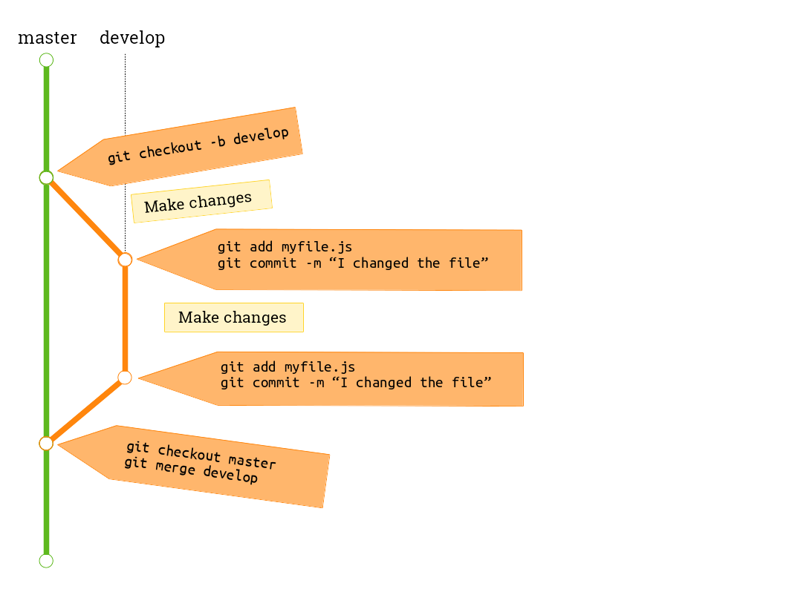
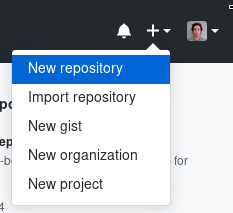
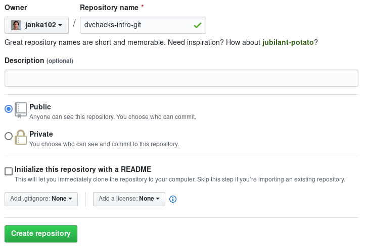
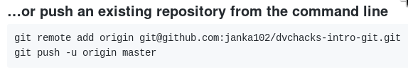

# Introduction to Git

<br>
<br>

.max-width-100[]

[janka102.github.io/dvchacks2019-intro-git/](janka102.github.io/dvchacks2019-intro-git/)

???
Welcome to the "Introduction to Git" workshop

---

# Some background

Hi, I'm Jesse.

I was a student at DVC and graduated in 2017. Now I'm at SFSU

I was president of dvcoders for a couple semesters  
One thing I saw was many students who didn't know how to use Git

So here we are!

???
First let me introduce myself...

---

# git init

What is Git?

Git is a version control system (VCS)

That means it keeps track of:

- all changes to a project
- who made the changes
- when they were made
- why they were made

Git can help with projects from one developer to a whole company of developers

Git is powerful!

???
Ok, let's talk about Git...

---

# Who actually uses Git?

Sure it sounds cool, but is it really going to be useful?

--

*YES!*

Many companies of all sizes use Git on a daily bases to help with managing projects

- [Google](https://github.com/google): [Material Design icons](https://github.com/google/material-design-icons)
- [Microsoft](https://github.com/Microsoft): [VS Code](https://github.com/Microsoft/vscode)
- [Linux](https://github.com/torvalds/linux)
- [DVCHacks](https://github.com/dvchacks)

Git is all around you, you can't get away!

---

# Git terminology

.definitions[
- *repository*: a project folder that has Git enabled
- *clone*: download a repository
- *branch*: separate version of code used to work on features
- *commit*: a short message describing a change
- *remote*: website to store the changes
- *push*: send changes to a remote
- *pull*: get changes from a remote
]

???
Let's get more familiar with Git

---

# Getting Git
### [https://git-scm.com/download](https://git-scm.com/download)

**Windows**

[Click here for easiest way to install Git on Windows](https://git-scm.com/download/win)

**macOS**

If you know you have homebrew, then it should be already installed  
Otherwise, [click here to download](https://git-scm.com/download/mac)

**Linux**

[Check here on how to do that for your distribution](https://git-scm.com/download/linux)

---

Once Git is  installed, test it by opening a terminal (or GitBash on Windows) and type `git --version`

There shouldn't be any issues.

<hr>

# GitHub.com

Next up is getting an account on [GitHub](https://github.com/join).

GitHub is a popular hosting site for Git repositories.

---

# The Git workflow

Start out by cloning a repo: `git clone https://github.com/me/my-project.git`  
Then `cd my-project`

1. Create a new branch: `git checkout -b branch_name`
  - *The original branch is no longer affected by any changes here*
2. Make and add changes: `git add myFiles.js`
3. Commit the changes: `git commit -m "I added some code"`
  - Repeat 2 and 3 as needed
4. Switch back to main branch: `git checkout master`
5. **Pull in case someone else made changes**: `git pull`
6. Merge your changes into master: `git merge develop`
7. Push changes to remote: `git push`
8. Repeat 1-8

---

# The Git workflow

.max-width-100[]

---

# Using Git for real

Let's get our hands dirty with some Git!

1. Create a new repo on GitHub

  

---

# Using Git for real

Name the repo  
Make sure to keep "Initialize this repository with a README" **unchecked**



---

# Using Git for real

There will be **Quick setup** instructions.

We will use this part:



2. Create a new folder (`mkdir dvchacks-intro-git` in the terminal)
3. Make a file called `README.md` and put this in there
  ```
  # DVCHacks 2019 Intro to Git
  ```

---

# Using Git for real

Let's finally run some Git commands! *Don't type the $*

```
$ git init
Initialized empty Git repository in /home/janka102/Projects/dvchacks-intro-git/.git/

$ git status
On branch master

No commits yet

Untracked files:
  (use "git add <file>..." to include in what will be committed)

	README.md

nothing added to commit but untracked files present (use "git add" to track)

$ git add README.md 

$ git commit -m "Added README"
[master (root-commit) 031998c] Added README
 1 file changed, 1 insertion(+)
 create mode 100644 README.md
 ```

---

# Using Git for real

Let's finally run some Git commands! *Don't type the $*

Now we have the new file committed locally and need to push it to GitHub  
Copy and paste from GitHub:

```
$ git remote add origin git@github.com:janka102/dvchacks-intro-git.git

$ git push -u origin master
Enumerating objects: 3, done.
Counting objects: 100% (3/3), done.
Writing objects: 100% (3/3), 248 bytes | 248.00 KiB/s, done.
Total 3 (delta 0), reused 0 (delta 0)
To github.com:janka102/dvchacks-intro-git.git
 * [new branch]      master -> master
Branch 'master' set up to track remote branch 'master' from 'origin'.
```

Reload GitHub and it should show up

---

# Adding our own code

First, we need to create a new branch

```
$ git checkout -b add-files
Switched to a new branch 'add-files'
```

Download this file and extract it [http://bit.ly/dvchacksIntroGit](http://bit.ly/dvchacksIntroGit)

```
$ git status
On branch add-files
Untracked files:
  (use "git add <file>..." to include in what will be committed)

	index.html
	main.css
	main.js
	skeleton.css

nothing added to commit but untracked files present (use "git add" to track)
```

---

# Adding our own code

```
$ git add .

$ git commit -m "Add our files"
[add-files 77fd2aa] Add our files
 4 files changed, 602 insertions(+)
 create mode 100644 index.html
 create mode 100644 main.css
 create mode 100644 main.js
 create mode 100644 skeleton.css

$ git push -u origin add-files
Enumerating objects: 7, done.
Counting objects: 100% (7/7), done.
Delta compression using up to 8 threads
Compressing objects: 100% (6/6), done.
Writing objects: 100% (6/6), 4.69 KiB | 4.69 MiB/s, done.
Total 6 (delta 0), reused 0 (delta 0)
remote: 
remote: Create a pull request for 'add-files' on GitHub by visiting:
remote:      https://github.com/janka102/dvchacks-intro-git/pull/new/add-files
remote: 
To github.com:janka102/dvchacks-intro-git.git
 * [new branch]      add-files -> add-files
Branch 'add-files' set up to track remote branch 'add-files' from 'origin'.
```

---

# Adding our own code

```
$ git checkout master
Switched to branch 'master'
Your branch is up to date with 'origin/master'.

$ git merge add-files
Updating 031998c..77fd2aa
Fast-forward
 index.html   |  48 ++++++++++
 main.css     |  64 ++++++++++++++
 main.js      |  72 +++++++++++++++
 skeleton.css | 418 ++++++++++++++++++++++++++++++++++++++++++++++++++++++++++++++++++++++++++++++++++++++
 4 files changed, 602 insertions(+)
 create mode 100644 index.html
 create mode 100644 main.css
 create mode 100644 main.js
 create mode 100644 skeleton.css

$ git push
Total 0 (delta 0), reused 0 (delta 0)
To github.com:janka102/dvchacks-intro-git.git
   031998c..77fd2aa  master -> master
```

---

# Preview our code

1. In GitHub copy link to index.html (https://github.com/janka102/dvchacks-intro-git/blob/master/index.html)
2. Open [https://htmlpreview.github.io/](https://htmlpreview.github.io/)
3. Paste in link and click Preview